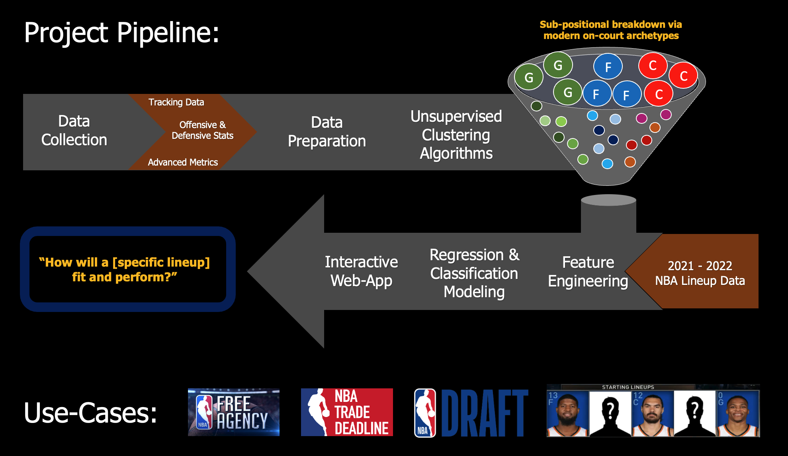
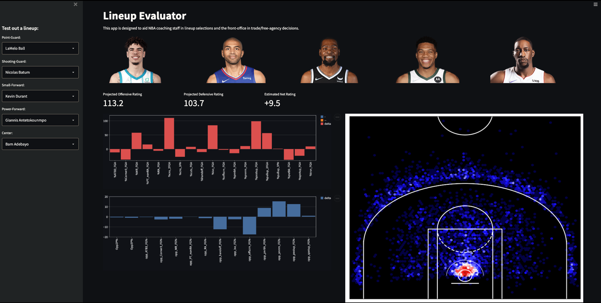
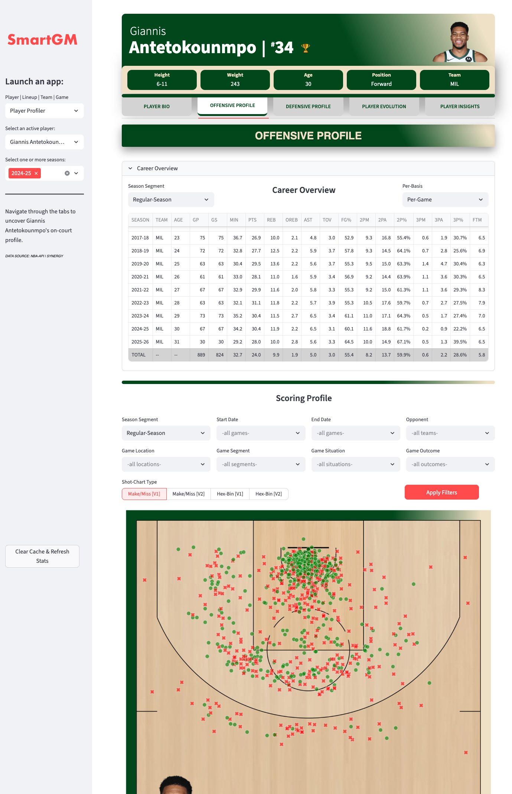

[![Issues][issues-shield]][issues-url]

<!--   -->
 
<h1 align="center">SmartGM</h1>
<h3 align="center">Basketball Operations Intelligence Platform</h3>
  <p align="center">
    Romith Challa
    <br />
    <br />
    <a href="https://github.com/rc-9/SmartGM/issues">Report Bug</a>
    ·
    <a href="https://github.com/rc-9/SmartGM/issues">Request Feature</a><br />
  </p>
</div>


 


<!-- TABLE OF CONTENTS -->
<details>
  <summary>Table of Contents</summary>
  <ol>
    <li>
      <a href="#project-overview">Project Overview</a>
    <li><a href="#usage">Usage</a></li>
  </ol>
</details>


## Project Overview

Analytics has transformed sports, with teams and fans constantly seeking new ways to quantify player impact. SmartGM is an end-to-end sports analytics pipeline that extracts and validates multi-source tracking data, engineers novel performance metrics, and executes unsupervised clustering to redefine traditional player positions using modern on-court archetypes. These refined “sub-positions” are then combined with lineup data to identify which player combinations drive success on the court. The result is an ML-powered decision-support tool that helps coaches optimize lineups, assists scouts in forecasting player development, and supports front offices in evaluating roster construction.

<br/>


<br/>
<br/>

#### Interactive Web-App Snapshots:




<br/>




<br/>

<p align="right">(<a href="#top">back to top</a>)</p>


## Usage
<br/>

Lineup Evaluator Tool:

- ```1_compiler.ipynb```: Scrapes player statistics and lineup data from multiple sources, then filters, compiles, and exports it for the next stage of the pipeline.
<br/>

- ```2_processor.ipynb```: Cleans, transforms, and wrangles the compiled NBA datasets based on insights from initial explorations.
<br/>

- ```3_explorer.ipynb```: Performs data mining to identify statistical patterns and inform the modeling stage. **NOTE: Not all visual outputs are pre-loaded. For best visual output and to utilize the interactive toggle-menu for plots, execute this script in a Jupyter notebook.**
<br/>

- ```4_modeler.py```: Executes any remaining pre-processing steps and applies unsupervised and supervised ML techniques to the players' statistical data.
<br/>

- ```5_visualizer.py```: Launches a preliminary dashboard application to evaluate lineups on their offensive and defensive synergy.
<br/>

Utilities: 

- ```hot_streak_finder.py```: Implements a divide-and-conquer algorithm to detect seasonal trends in player performance.
<br/>

- ```pp_generate_shot_charts```: Generates custom shot-charts based on user-defined settings in the web app.
<br/>

#### *More tools coming soon!*
<br/>


<p align="right">(<a href="#top">back to top</a>)</p>


<!-- MARKDOWN LINKS & IMAGES -->
[issues-shield]: https://img.shields.io/github/issues/rc-9/SmartGM.svg?style=for-the-badge
[issues-url]: https://github.com/rc-9/SmartGM/issues


